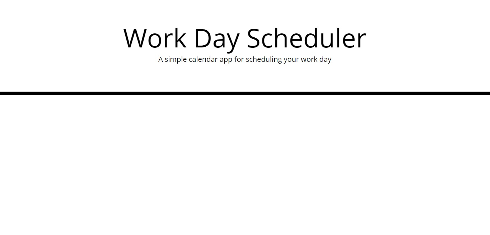
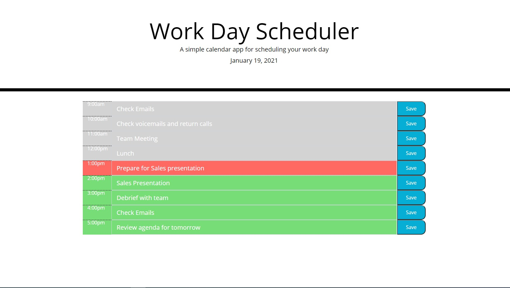

# dayPlanner

The goal of this project is to create a scheduler to add events to a daily planner.  These events will be stored to the local storage where we can set and get the information. The calendar is also color coded to update with the current time. If the time has passed, the text box will be greyed out, the present time will be red, and future time is green.  Some starter code is already given.  A screen shot of how it displays is below: 



The goal of this project is as follows:
```
-Current Date is displayed when the planner is opened
-The time blocks for the planner displays standard business hours
-The time blocks are color coded to indicate if the date is past, present, or future
-Each time block allows the user to enter test and saves the information to local storage 
-The information is still displayed even if the page is refreshed
```

This is what the page looks like after it is finished: 



Throughout the day, each hour block will update as displayed above.  Gray represents previous hours, red is the current hour and green represents future hours.  The time is updated with momentjs and can be manipulated on javascript.js on line 20.  

If you would like to test the page, you can pass {hour:XX} as a parameter inside moment() with 'XX' representing the hour in military time.

As noted above, each time slot is saved to the local storage so the information is still there if the page is refreshed.  You can click on any save button to update the information on the local storage.

Github repository: https://github.com/jimnguyen220/dayPlanner

Live website: https://jimnguyen220.github.io/dayPlanner/

Resources:

https://getbootstrap.com/

https://momentjs.com/

